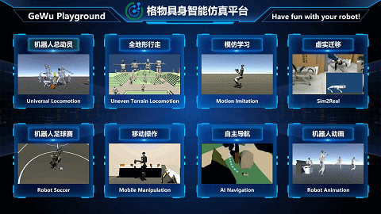
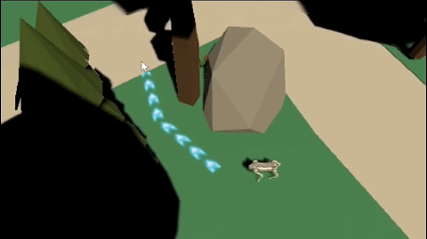
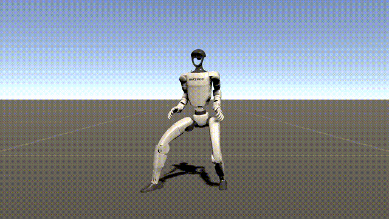
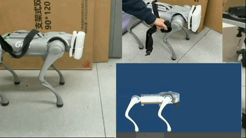

# “格物”具身智能仿真平台 ([English](README_en.md) | [中文](README.md))

#  

| 
 [格物2.0](https://www.bilibili.com/video/BV1iJbSz9Eem/) 
 | 
  [具身智能小镇](https://www.bilibili.com/video/BV1T7jBzVEZV/) 
 |
| ---  | --- |
|  |  |

  
| 
 [机器人总动员](https://www.bilibili.com/video/BV167RbYxEuG/) 
 | 
  [全地形行走](https://www.bilibili.com/video/BV1ZDjGz9EJH/) 
 |  
 自主导航 
 |  
 [机器人动画](https://www.bilibili.com/video/BV1maEPzQEtD/?vd_source=25bf190003ff1ebd36e7649d3641e141) 
 |
| ---  | --- | --- | --- |
|  |  |  |  |

  
| 
 [功夫足球](https://www.bilibili.com/video/BV1NuZBYeEq8/) 
 | 
  [模仿学习](https://www.bilibili.com/video/BV1RmKhzVEbS/) 
 |
 [Sim2Real](https://b23.tv/y8wXu2N) 
 | 
  [移动操作](https://www.bilibili.com/video/BV1qCaUzFEVk/) 
 |
| ---  | --- | ---  | --- |
|  |  | |  |

---

“格物”是由国家地方共建人形机器人创新中心、上海大学、清华大学联合推出的具身智能仿真训练平台。该项目基于Unity ML-Agents工具包构建，旨在为研究人员和普通大众提供一个高效且友好的强化学习开发环境，适用于各类机器人。[<a href="gewu/Image/gewu-wechat.png">格物平台微信交流群</a>]

- **开放原子大赛：[用格物平台实现机器人1v1踢足球](https://competition.atomgit.com/competitionInfo?id=2722363746f99a7d49c7ca5ee280194a#heading-0-0)**

赛题场景在Assets/Competition目录下，提供了两套例程，TinkerPlay1/TinkerTrain1为基础版,TinkerPlay2/TinkerTrain2为升级版

双击TinkerPlay1/2打开即为Tinker足球赛，预设为双人对战模式，一人通过键盘上的WASD键控制行走方向、左ctrl键复位机器人，另一人通过键盘上的上下左右键控制行走方向、右ctrl键复位机器人，空格键复位足球

TinkerTrain1/2为对应的强化学习训练例程，参赛者需在例程基础上实现机器人自主踢球、摔倒爬起

- **2025.8.14，格物2.0（Gewu Playground 2.0）代码发布**

  采用Unity2022（兼容团结引擎），集成主界面UI，行走、导航、操作全覆盖，提供[免安装版](https://pan.baidu.com/s/1HFQvqdZcPr0HI1gCn6BGFg?pwd=adnq)体验

- **2025.7.17，添加ROS2插件及Sim2Real例程(Go2)**
- **2025.7.01，添加机器人动画例程**
- **2025.6.29，添加人形机器人通用移动操作例程**
- **2025.6.23，添加模仿学习例程，让机器人学会跳舞**
- **2025.5.28，上线机器人乐园和清明上河图**
- **2025.5.25，添加复杂地形例程**
- **2025.4.19，添加动作重映射例程、添加四轮足例程**
- **2025.4.04，格物1.0（Gewu Playground 1.0）上线，全面升级**

  升级至Unity2023，依赖包预置，代码优化，新增足球赛例程

- **2025.3.20，格物0.1（Unity RL Playground）代码发布**

  采用Unity2021，打包为UnityPackage，机器人总动员例程

## 相关论文

**更多技术细节，或使用本平台进行研究请参考和引用以下论文：**

[1] Ye, Linqi, Rankun Li, Xiaowen Hu, Jiayi Li, Boyang Xing, Yan Peng, and Bin Liang. "Unity RL Playground: A Versatile Reinforcement Learning Framework for Mobile Robots." arXiv preprint arXiv:2503.05146 (2025). [PDF](https://arxiv.org/abs/2503.05146)

[2] Ye, Linqi, Jiayi Li, Yi Cheng, Xianhao Wang, Bin Liang, and Yan Peng. "From knowing to doing: learning diverse motor skills through instruction learning." arXiv preprint arXiv:2309.09167 (2023).[PDF](https://arxiv.org/abs/2309.09167) 

## 使用说明

适用于Windows、Linux、MacOS等操作系统，[Mac-Silicon补充说明](macos-setup-Silicon.md)，[Mac-Intelcore补充说明](macos-setup-Intelcore.md)

## 一、仿真环境安装

1. 搜索安装Unity Hub，注册登录，弹出的Install Unity Editor窗口点击skip跳过，然后点击Agree and get personal edition license免费激活

2. 在打开的Unity Hub界面，在Installs菜单点击Install Editor，选择Unity Editor 2022版本（2022.3）安装（7个多G，耐心等待）

3. 下载Unity RL Playground：https://github.com/loongOpen/Unity-RL-Playground ，解压到本地

4. 在Unity Hub的Projects菜单中点击Open，选择上一步解压的Unity-RL-Playground\gewu目录，点击Open，等待项目打开（第一次打开耗时较长，耐心等待），若弹窗选择ignore或continue即可

5. 项目打开后，在Unity下方的小窗口可看到Assets目录下的GewuMenu.unity，双击打开，即显示格物主界面，点击unity上面的三角形运行，可依次点击进入8个功能模块

6. 录制视频在菜单栏Window->General->Recorder->Recorder Window，点击Add Recorder->Movie，点击红色三角形即可录制，在下方Path可找到保存路径

也可以不通过主界面打开每个例程：

## 机器人总动员例程

在Assets/Playground目录下，点击进入该目录，双击Playground.unity打开，点击unity上面的三角形运行即可看到机器人预训练好的运动效果

选中某个机器人，在右边inspector窗口可在对应的target motion下拉框切换运动模式（如果对应的预训练模型非空）

## 复杂地形例程

在Assets/Playground目录下，Terrain.unity

长30cm高15cm台阶，预训练青龙、宇树G1、加速进化T1、众擎SA01

注意训练时要单独每个机器人，其他机器人隐藏

采用课程学习，训练时逐渐增大楼梯高度（调整Stairs的Scale的y值）

## 机器人足球赛例程

在Assets/Playground目录下，双击LoongPlay.unity打开即为青龙功夫足球，预设为自动对战模式，只当足球卡在角落时可按空格键复位

## 动作重映射与模仿学习例程

在Assets/Imitation目录下，G1.unity，包含宇树H1、G1两个机器人

运行可看到H1预训练好的吉他、高尔夫、小提琴、挥手动作（共用一个神经网络）,以及预训练好的G1查尔斯顿舞蹈动作

动作均存放在dataset目录下（H1动作来源于Humanoid2Humanoid方法从AMASS数据库生成，G1动作来源于LEFAN1数据集）

模仿学习训练：只勾选Train进行训练（参考后面步骤）

重映射动作播放：只勾选Replay可播放动作

Motion_id为动作序号，可修改，运行时可在Motion_name看到动作名称

## 移动操作例程

在Assets/Manipulation目录下，G1OP.unity

采用键盘控制机器人进行行走和操作

## 机器人动画例程

在Assets/Animation目录下，双击打开dance.unity，运行即可看到G1机器人舞蹈、弹琴、演唱的动画效果

更多动画效果可在Assets/Animation/Animations目录下找到

## SIm2Real例程

在Assets/Ros2ForUnity/Go2文件夹下，Go2Deploy.unity，仅限Ubuntu20、22使用（main分支适用于ubuntu22，foxy分支适用于ubuntu20）

使用ROS2实现与机器人的通信和策略部署，目前支持宇树Go2，需要安装ROS2（[Ubuntu20参考](https://docs.ros.org/en/foxy/Installation/Alternatives/Ubuntu-Development-Setup.html) [Ubuntu22参考](https://docs.ros.org/en/humble/Installation/Ubuntu-Install-Debs.html)），以及[Unitree_ROS2](https://support.unitree.com/home/zh/developer/ROS2_service)

注意在~/.bashrc中加入以下两条语句（根据你的unitree_ros2和gewu实际路径修改）：

source ~/ylq/unitree_ros2/setup.sh

export LD_LIBRARY_PATH=$LD_LIBRARY_PATH:/home/ylq/ylq/Unity-RL-Playground/gewu/Assets/Ros2ForUnity/Plugins/Linux/x86_64

Go2Deploy.unity打开后，在左侧窗口选中Go2Real，在右侧inspector勾选is_ros2_installed

用网线连接机器狗与电脑，机器狗开机后通过手机app连接，点击卧倒让其趴在地上，然后在app进入设备-服务状态，点击mcf将主运控服务关闭（点击一次后稍等一会）

Go2Deploy.unity为真机部署例程，运行前确保机器狗趴在地上且mcf关闭，运行开始机器狗会稍微站起，点击stand up，直到机器狗完全站起。然后勾选FF_enable（前馈使能），机器狗开始踏步，再勾选NN_enable（神经网络使能），此时便可通过键盘WASD控制机器狗行走和转弯，结束时先取消FF_enable和NN_enable，点击lie down即可

Go2Train.unity用于策略的训练

## 自主导航例程

在Assets/Navigation/Scene目录下，打开Go2Navi.unity，在屏幕点击任意目标点

该例程使用Unity的AI Navigation插件，自主规划路线，并调用预训练好的Go2全向行走模型进行控制

## 二、训练环境安装

1. 安装Anaconda：https://www.anaconda.com/download

2. 在电脑搜索框搜索anaconda，点击打开anacconda prompt命令行窗口

3. 运行`conda create -n gewu python=3.10.12 -y`

4. 运行`conda activate gewu`

5. 运行`pip3 install torch~=2.2.1 --index-url https://download.pytorch.org/whl/cu121`

    （确保网络畅通，耗时较长，耐心等待，若安装失败可换个网络试试）

6. 运行`python -m pip install mlagents==1.1.0`

    （耐心等待）

7. 运行`mlagents-learn --help`检查是否安装成功（无报错即可）

## 三、训练机器人

以机器人总动员例程为例进行说明：

1. 在Assets/Playground打开Playground.unity，在左侧面板选中一个要训练的机器人（例如Go2），然后在右侧inspector中勾选train

2. 选中其他机器人将他们都隐藏（在inspector窗口将最上面一个方框的勾取消即可）

3. 回到anaconda界面，进入Unity-RL-Playground主目录（例如，先运行`D:` 再运行 `cd D:\Unity-RL-Playground-main\gewu\Assets\Playground` （根据自己的实际目录调整））

4. 运行`mlagents-learn config.yaml --run-id=go2trot --force`开始训练

    （注：id号名称可自己任取，--force为从零训练，若使用--resume则为断点继续训练）
   
6. 当窗口中出现[INFO] Listening on ...时回到unity界面，点击上面的三角形按钮运行即可开始训练

7. 训练时可在anaconda窗口观察训练进度，正常来说奖励会逐渐升高，一般训练2000000个step即可，按ctrl+c终止训练

8. 终止训练后在unity界面下方找到刚刚训的神经网络，在results->go2trot（名称与run-id一致）目录中，可看到一个gewu.onnx的文件，即为训练好的神经网络。如要查看训练的奖励曲线等，可在anaconda窗口运行tensorboard --logdir results --port 6006，然后在浏览器输入http://localhost:6006/ 进入即可

9. 点击选中机器人，在右侧inspector窗口可看到很多policy的方框，将训练好的神经网络拖动到对应方框中（如Q trot policy）

10. 在右侧inspector中取消勾选train，运行unity，即可看到机器人的运动效果

11. 类似地，可对TinkerTrain.unity和LoongTrain.unity进行训练，训练所得的神经网络可用于TinkerPlay.unity和LoongPlay.unity

## 四、导入和训练新的机器人

1. 机器人urdf文件位于Assets\urdf目录

2. 机器人urdf文件夹中一般包含xx.urdf以及meshes文件夹，xx.urdf里面的路径格式为package://meshes/xxx.STL，机器人腿部以外的关节最好已经锁定。        （注：如果腿部以外有关节未锁定，可在导入后打开机器人结构树，选中对应的ArticulationBody将Articulation Joint Type由Revolute改为Fix）

3. 在unity中打开预制的空场景MyRobot.Unity

4. 以众擎机器人为例，在urdf文件夹中进入zq_humanoid，单击选中zq_sa01.urdf，点击菜单栏Assets->Import Robot from Selected URDF，弹出窗口，将mesh decomposer选择unity，点击import URDF

5. 看到机器人模型导入后，选中机器人在右侧inspector调整高度(y轴)使其脚着地，可稍高一点点

6. 选中导入的机器人，在inspector窗口将Urdf Robot (script)和Controller (script) 都删除

7. 拖动导入的机器人到MyRobot的子节点中

8. 选中MyRobot，在inspector窗口选择对应的RobotType（众擎机器人保持默认Biped即可）和Target Motion（此例在Biped下面保持默认的Walk即可），在Behaviour Parameters设置observation和action维数（此例保持默认即可），可参考其他机器人

9. 训练前测试，选中Fixbody复选框，运行unity查看前馈动作是否正确，双足walk步态下机器人应上下踏步

10. 如前馈不匹配，可在GewuAgent代码中搜索“change here”,找到对应代码修改适合本机器人的参数（本例中在285行的idx六个数全加上负号即可），看到机器人正常上下踏步即可

    （注：idx代表要给前馈的关节，对于双足是髋、膝、踝的三个pitch关节，一般来说数值用默认即可（少数构型不一致的需修改），正负号和关节转向有关，根据情况修改）

11. 配置完毕，即可通过`mlagents-learn …… `语句进行训练（参考“三”中步骤），本例只需训练40万step（2～5分钟）即可看到效果

**更多机器人URDF模型，见以下仓库：https://github.com/linqi-ye/robot-universe, 集齐了众多机器人URDF模型**
