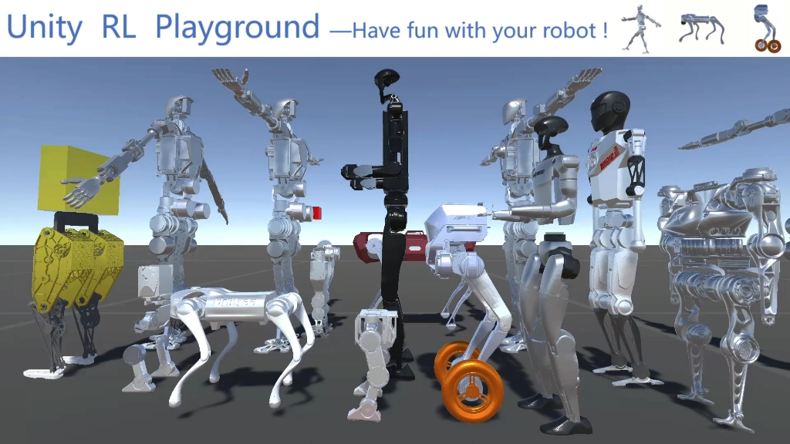

# “格物”具身智能仿真平台

**点击下图观看视频**

使用本平台进行的研究请引用以下论文：

[1] Ye, Linqi, Rankun Li, Xiaowen Hu, Jiayi Li, Boyang Xing, Yan Peng, and Bin Liang. "Unity RL Playground: A Versatile Reinforcement Learning Framework for Mobile Robots." arXiv preprint arXiv:2503.05146 (2025). [PDF](https://arxiv.org/abs/2503.05146)

[2] Ye, Linqi, Jiayi Li, Yi Cheng, Xianhao Wang, Bin Liang, and Yan Peng. "From knowing to doing: learning diverse motor skills through instruction learning." arXiv preprint arXiv:2309.09167 (2023).[PDF](https://arxiv.org/abs/2309.09167) 

## 一、仿真环境安装

1.搜索安装Unity Hub，注册登录后使用Personal Licenses可免费激活

2.打开Unity Hub，在Installs菜单选择Unity Editor 2021 LTS版本安装

3.下载Unity ML-Agents：https://github.com/Unity-Technologies/ml-agents ，在Releases列表中选择Release 20版本下载并解压

4.下载URDF-Importer：https://github.com/Unity-Technologies/URDF-Importer ，解压，可放至ml-agents-release_20主目录中

5.在Unity Hub的Projects菜单中点击Open，选择ml-agents-release_20\Project目录打开

6.在Unity的Window->Package Manager中点击“+”，点击Add package from disk，选择URDF-Importer-main\com.unity.robotics.urdf-importer\package文件打开，完成URDF importer的导入

7.下载Unity RL Playground：https://github.com/loongOpen/Unity-RL-Playground ，将“Unity-RL-Playground.part1.rar”和“Unity-RL-Playground.part2.rar”两个压缩包同时选中解压，得到Unity-RL-Playground.unitypackage

8.在Unity的菜单栏Assets->Import Package，选择Unity-RL-Playground.unitypackage，在弹出窗口点击import

9.此时在Unity下方的小窗口可看到Assets目录下的Unity-RL-Playground-main，点击进入该目录下，双击Playground.unity打开，点击unity上面的三角形运行即可看到机器人预训练好的运动效果！

10.选中某个机器人，在右边inspector窗口可在对应的target motion下拉框切换运动模式（如果对应的预训练模型非空）

## 二、训练环境安装

1.安装Anaconda：https://www.anaconda.com/download

2.打开anacconda窗口

3.运行conda create -n ml-agents python=3.7

4.运行activate ml-agents

5.运行pip3 install torch~=1.7.1 -f https://download.pytorch.org/whl/torch_stable.html

6.运行python -m pip install mlagents==0.28.0

7.运行pip install importlib-metadata==4.4

8.运行pip install six

9.运行mlagents-learn --help检查是否安装成功

## 三、训练机器人

1.在unity打开Playground.unity，选中一个要训练的机器人（如tinker），在右侧inspector中勾选train

2.将其他机器人隐藏（在inspector窗口将最上面一个方框的勾取消即可）

3.回到anaconda界面，进入Unity-RL-Playground主目录（例如，先运行D: 再运行 cd D:\ml-agents-release_20\Project\Assets\Unity-RL-Playground-main （根据自己的实际目录调整））

4.运行mlagents-learn trainer_config.yaml --run-id=tinker --force开始训练（注：id号名称可自己任取，--force为从零训练，若使用--resume则为断点继续训练）

5.当窗口中出现[INFO] Listening on ...时回到unity界面，点击上面的三角形按钮运行即可开始训练

6.训练时可在anaconda窗口观察训练进度，正常来说奖励会逐渐升高，一般训练2000000个step即可，按ctrl+c终止训练

7.终止训练后再unity界面下方找到刚刚训的神经网络，在results->tinker（名称与run-id一致）目录中，可看到一个gewu.onnx的文件，即为训练好的神经网络

8.点击选中机器人，在右侧inspector窗口可看到很多policy的方框，将训练好的神经网络拖动到对应方框中（如B walk policy）

9.在右侧inspector中取消勾选train，运行unity，即可看到机器人的运动效果

## 四、导入和训练新的机器人

1.将新的机器人urdf文件夹（包括meshes）放入Unity-RL-Playground-main\urdf文件夹

2.机器人urdf文件夹一般命名为xx_description，里面包含xx.urdf以及meshes文件夹，xx.urdf里面的路径格式为package://meshes/xxx.STL，机器人腿部以外的关节最好已经锁定。（注：如果腿部以外有关节未锁定，可在导入后打开机器人结构树，选中对应的ArticulationBody将Articulation Joint Type由Revolute改为Fix）

3.在unity下方点击选中机器人xx.urdf，点击菜单栏Assets->Import Robot from Selected URDF，弹出窗口，将mesh decomposer选择unity，点击import URDF

4.看到机器人模型导入后，选中机器人在右侧inspector调整高度(y轴)使其脚着地，可稍高一点点

5.将示例程序中其他机器人隐去

6.右键create empty，将gameobject名称改为自己机器人名字

7.拖动导入的机器人到上一步gameobject的子节点中

8.选中gameobject，在inspector窗口点击add component，搜索添加RobotRLAgent代码，再次点击add component，搜索添加decision requester

9.在Behaviour Parameters设置observation和action维数，可参考其他机器人

10.训练前测试，可选中Fixbody复选框，运行unity查看前馈动作是否正确，如报错不匹配，可在RobotRLAgent代码中的if (name.Contains("机器人名称"))添加适合本机器人的参数即可，具体参考其他机器人

11.配置完毕，即可依照“三”中步骤进行训练

## (注：以上面中文为准，英文版不全，待更新)
## (The Engilish version is to be updated)

# Unity-RL-Playground
Unity RL Playground (also named **Gewu**) is an embodied intelligence robotics simulation platform jointly launched by the National and Local Co-Built Humanoid Robotics Innovation Center, Shanghai University, and Tsinghua University. Built on top of the Unity ML-Agents Toolkit, this project aims to provide researchers and developers with an efficient and user-friendly reinforcement learning (RL) development environment.

## Related Publication
For more details about the framework, please refer to our publication:
Linqi Ye, Rankun Li, Xiaowen Hu, Jiayi Li, Boyang Xing, Yan Peng, Bin Liang. "Unity RL Playground: A Versatile Reinforcement Learning Framework for Mobile Robots." arXiv preprint arXiv:2503.05146 (2025). https://arxiv.org/abs/2503.05146

## Platform Features‌

- **Extensive Robot Support‌**: Compatible with hundreds of mobile robots, including humanoid robots, quadruped robots, wheeled robots, and more.
- **One-Click Import & Training‌**: Allowing users to effortlessly import robot models and initiate training without complex configurations.
- **Lowered RL Development Barrier‌**: Simplifies workflows and provides toolkits to make RL technology accessible and approachable for everyone.

## Open-Source & Community Support‌

- **Open-Source Project‌**: Unity RL Playground is fully open-source, with code and resources publicly available on GitHub for developers to freely access and contribute.
- **Community-Driven Growth‌**: We welcome global developers to join our community, collaborate on advancing the platform, and share technical expertise.

Unity RL Playground is committed to becoming an open platform for embodied intelligence, accelerating innovation in robotics technology. Whether you are an academic researcher, developer, or enthusiast, you will find tailored tools and resources here to empower your work.

# Installation of Unity and ML-Agents
## 1 Install Unity

Download and install the latest version of the Unity Editor. It is recommended to choose the LTS (Long-Term Support) version to ensure stability.

## 2 Configure ML-Agents

### 2.1 Create a Virtual Environment

Install Anaconda

If Anaconda is not already installed, visit the Anaconda official website to download and install it.

Create a Virtual Environment

Open the Anaconda Prompt and run the following command to create a virtual environment named "RL-Playground" with Python 3.10: `conda create -n RL-Playground python=3.10`

Activate the virtual environment: `conda activate RL-Playground`

### 2.2 Install ML-Agents

Download ML-Agents

Download the latest version of the ML-Agents toolkit from the ML-Agents GitHub page.

Note: The download path must not contain Chinese characters, as this may cause training failures.
Install ML-Agents Packages

After extracting the downloaded files, navigate to the ml-agents and ml-agents-envs directories, and execute the following commands in each directory to install them: `pip install .`

After installation, run the following command to verify that the installation was successful: `mlagents-learn --help`

### 2.3 Configure Unity

Create a Unity Project

Open the Unity Editor, click the Open button, and select the ML-Agents project you downloaded: ml-agents-release_20—ml-agents-release_20——Project

# Installing and Using the URDF Importer

## 1. Download the URDF Importer

Download the URDF Importer: https://github.com/Unity-Technologies/URDF-Importer

## 2. Add the URDF Package

Open the Unity Package Manager

Open the Package Manager from the Unity menu: Click Window > Package Manager.

Add the URDF Package

In the top-left corner of the Package Manager window, click the + button and select Add Package from Git disk.

Locate the `package.json` file in the `URDF-Importer-main\com.unity.robotics.urdf-importer` directory and proceed with the installation.

## 2. Create a Robot Using a URDF File

Prepare the URDF File and Related Resources

Copy the URDF file and its related files (such as mesh files) into the Assets folder of your Unity project. Ensure that the paths to the mesh files are correct.

Import the Robot

In the Project window, right-click on your URDF file and select Import Robot from Selected URDF file.

Configure Import Settings

A window will appear with import settings for the robot:

Mesh File Orientation: Set the orientation of the mesh files.

Collision Mesh Decomposition Algorithm: Choose the algorithm for collision mesh decomposition.

Complete the Import

Click the Import URDF button to complete the robot import.

# Importing and Configuring Unity RL Playground

Drag the downloaded Unity-RL-Playground-main into ml-agents-release_20/ml-agents-release_20/Project/Assets. After importing the environment, the following operations need to be performed:

## 1. Initial Environment Configuration
 
Click on Layers in the upper right corner of the interface, select Edit Layers, and add robot at the end of the Layers list.

Click on Edit -> Project Settings -> Physics, uncheck the robot in the Layer Collision Matrix, and change the Fixed Timestep under Time to 0.01.

Drag the RobotRLAgent.cs script into the missing Script slot under each robot.

Drag the policy network under nnmodel into the None (NN Model) slot under the corresponding robot, and click play to run the several robot gaits in the example.

## 2. Agent Configuration

Max Step: Set to 1000, representing the maximum number of steps per training episode.

Test Feedforward Actions：If Fixed Body is selected, click the Unity Play button to observe whether the feedforward actions applied to the robot are correct.

Robot Type: Select the type of robot (e.g., Biped, Quadruped, Legwheeled).

Target Motion: Select the target motion to be trained.

Accelerate: Set Time.timeScale to 20 to accelerate the training process.

# Start Training

## 1. Initiate Training

Disable Controller Scripts: Uncheck the imported robot controller scripts.

Enable Training Options: Check Train and Accelerate (if accelerated training is desired).

Start Training Command: Open the Anaconda Prompt and navigate to the directory containing the configuration file: `cd /path/to/your/config/file`

Enter the following command to start training: `mlagents-learn configuration.yaml --run-id=g1_jump --force`

If you need to resume the previous training, use the following command: `mlagents-learn configuration.yaml --run-id=g1_jump --resume`

After training begins, the terminal will output prompt messages prefixed with [INFO].

Verify Training Status: Open Unity and start the game. If the terminal prints out the contents of the configuration file, it indicates that the training has started normally.

## 2. Monitoring the Training Process

During the training process, reward data will be output based on the number of steps set in the configuration file (for example, reward data may be output every 20,000 steps). If you need to manually interrupt the training, you can press the shortcut Ctrl+C in the Anaconda Prompt.

## 3. Analyzing Training Results:Viewing Training Statistics Using TensorBoard

In the Anaconda Prompt, while in the same directory, enter the following command: `tensorboard --logdir results/g1_jump`

The terminal will output a TensorBoard URL (e.g., http://localhost:6006/). Open this URL to view the training statistics graphs.

## 4. Running the Trained Model

After training is complete, the terminal will indicate the location of the trained model file (in .onnx format). Drag the model file into the corresponding field in the RobotRLAgent script. Launch the Unity game to observe the training results.
